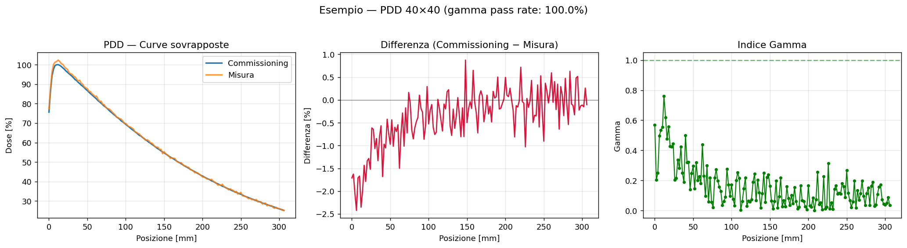
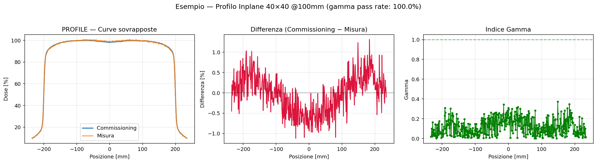

# Relative Dose 1D — Commissioning vs Measurement QA

App **Streamlit** per il confronto tra dati di **commissioning** (TPS, formato w2CAD `.data`) e **misure sperimentali** (PTW Verisoft, formato `.mcc`) di curve di dose 1D — PDD e profili.

Basata e adattata dal progetto [relative_dose_1d](https://github.com/) di Luis Alfonso Olivares Jimenez, riscritta come web app con parsing multi-curva, analisi gamma vettorizzata e metriche automatiche per i profili (flatness, symmetry, penombra).

## Funzionalità

- **Caricamento multi-file**: puoi caricare più file `.data` e più file `.mcc` insieme; tutte le curve trovate vengono raccolte in un unico elenco selezionabile.
- **Parsing multi-curva**: un singolo file (soprattutto `.mcc`) può contenere più scansioni (PDD, profili inplane/crossplane, a diverse profondità/campi): l'app le estrae tutte e le presenta in un menu a tendina, etichettate con file di origine, tipo, direzione, profondità e field size.
- **Analisi gamma index 1D** (globale, dosi normalizzate 0–100%), con parametri configurabili: dose difference [%], distance-to-agreement [mm], soglia dose [%], punti di interpolazione.
- **Dose a profondità specifica** (solo per le PDD): confronto tra commissioning e misura della dose interpolata a una profondità scelta (default 100 mm), con verifica di tolleranza **±1%** (differenza assoluta in punti percentuali).
- **Flatness, Symmetry e Penombra** (solo per i profili), calcolate secondo definizione IEC-style, con:
  - verifica di tolleranza **±1%** applicata solo a **Flatness** e **Symmetry**;
  - Field size, Center e Penombra riportati per riferimento, senza verifica di tolleranza;
  - un **alert dedicato** se il field size misurato differisce da quello di commissioning oltre l'1%.
- **Supporto ai profili parziali** ("metà profilo"): se il commissioning contiene solo un lato del profilo (prassi comune per risparmiare tempo di scansione assumendo un campo simmetrico), l'app lo rileva automaticamente e:
  - stima field size/flatness assumendo simmetria rispetto all'asse centrale (x=0);
  - calcola la penombra solo sul lato disponibile (l'altro lato è `N/A`);
  - riporta la symmetry come `N/A` (non verificabile da un solo lato) ed esclude quel confronto dalla verifica di tolleranza.

## Formati file supportati

| Formato | Estensione | Uso tipico | Note |
|---|---|---|---|
| w2CAD (TPS Eclipse) | `.data` | Commissioning | Curve delimitate da `$STOM...$ENOM` o `$STOD...$ENOD`. Il tipo di curva (PDD/profilo) è dedotto dai metadati `%title` / `%axis legend`, non dal tag (alcuni export usano `$STOD` per tutto). |
| PTW Verisoft (CC-Export) | `.mcc` | Misure | Un file può contenere più scansioni in un unico blocco `BEGIN_SCAN_DATA...END_SCAN_DATA`, con sotto-blocchi `BEGIN_SCAN n...END_SCAN n` per ciascuna curva (metadati `SCAN_CURVETYPE`, `SCAN_DEPTH`, `FIELD_INPLANE`/`FIELD_CROSSPLANE`). È supportato anche il vecchio formato "flat" (un blocco `BEGIN_SCAN_DATA` per curva) come fallback. |

I parser sono tolleranti ma seguono le convenzioni osservate nei file reali testati; export molto diversi potrebbero richiedere piccoli adattamenti.

## Esempi

Grafici generati dall'app (dati reali di test perturbati con piccolo rumore sintetico per illustrare un confronto commissioning vs misura tipico).

### PDD



Per questa stessa coppia di curve, il confronto **dose a profondità specifica** (default 100 mm) restituito dall'app è:

| Profondità | Commissioning | Misura | Differenza | Entro ±1% |
|---|---:|---:|---:|:---:|
| 100 mm | 69.35% | 69.88% | +0.53 pp | ✅ |

### Profilo



Tabella dei parametri corrispondente all'esempio di profilo sopra:

| Parametro | Commissioning | Misura | Differenza | Verifica ±1% |
|---|---:|---:|---:|:---:|
| Flatness [%] | 1.731 | 2.358 | +0.63 pp | ✅ |
| Symmetry [%] | 0.492 | 1.212 | +0.72 pp | ✅ |
| Field size [mm] | 400.108 | 399.936 | −0.04% | — |
| Center [mm] | 0.208 | 0.210 | +0.00 mm | — |
| Left penumbra [mm] | 9.437 | 9.319 | −1.25% | — |
| Right penumbra [mm] | 9.471 | 9.638 | +1.76% | — |

## Installazione

```bash
git clone <repo-url>
cd <repo-folder>
pip install -r requirements.txt
```

Requisiti principali: `streamlit`, `numpy`, `matplotlib` (vedi `requirements.txt`).

## Avvio

```bash
streamlit run app.py
```

> Il **main file** da eseguire è sempre `app.py`. `dose_tools.py` è il modulo di parsing/analisi importato da `app.py` e non va lanciato direttamente.

## Utilizzo

1. Carica uno o più file di **commissioning** (`.data`) e uno o più file di **misura** (`.mcc`).
2. Seleziona dai menu a tendina la curva di riferimento (commissioning) e quella da valutare (misura).
3. Conferma/correggi il tipo di curva rilevato (PDD o PROFILE).
4. Imposta i parametri dell'analisi gamma (dose%, DTA, soglia, interpolazione) e premi **Esegui analisi**.
5. Visualizza:
   - il grafico delle curve sovrapposte, la differenza e l'indice gamma;
   - il pass rate gamma e i punti valutati;
   - **se la curva è una PDD**: il confronto della dose a una profondità scelta (default 100 mm, modificabile), con la verifica di tolleranza ±1%;
   - **se la curva è un profilo**: la tabella flatness/symmetry/penombra con la verifica di tolleranza ±1% su flatness/symmetry e l'eventuale alert sul field size.

## Struttura del progetto

```
.
├── app.py            # interfaccia Streamlit (upload, selezione curve, grafici, tabelle)
├── dose_tools.py      # parsing file (.data / .mcc), gamma index, metriche di profilo
├── requirements.txt   # dipendenze Python
└── assets/            # immagini di esempio usate in questo README
```

## Dettagli sulle metriche

**PDD**
- **Dose a profondità specifica**: dose interpolata linearmente (via `numpy.interp`) alla profondità scelta (default 100 mm) sulle posizioni misurate. Se la profondità richiesta è fuori dal range misurato di una delle due curve, l'app segnala l'errore invece di restituire un valore non affidabile. La tolleranza ±1% è applicata come differenza assoluta in punti percentuali tra commissioning e misura.

**Profili**
- **Flatness**: `100 · (Dmax − Dmin) / (Dmax + Dmin)` calcolata sul volume centrale (80%) del campo, definito tra i punti al 50% di dose massima ai bordi.
- **Symmetry**: differenza massima punto-a-punto tra dose e dose speculare rispetto al centro, normalizzata sulla dose al centro (%). Non calcolabile per i profili parziali.
- **Penombra**: distanza tra i livelli 80%–20% di dose massima ai bordi del campo (sinistro e destro).
- **Field size / Center**: derivati dai punti di crossing al 50% della dose massima.

## Limitazioni note

- L'indice gamma è globale (non locale) e 1D.
- Le metriche di profilo assumono un unico picco/plateau centrale; fasci molto atipici (es. FFF fortemente piccati, wedge, profili diagonali) vanno interpretati con cautela.
- Per i profili parziali si assume simmetria del campo rispetto a x=0: se il campo reale non è simmetrico, field size/flatness stimati saranno approssimati.
- Il parsing dei formati `.data`/`.mcc` è stato validato su file reali disponibili durante lo sviluppo; varianti di export non testate potrebbero richiedere adattamenti al parser.

## Licenza

Da definire.
