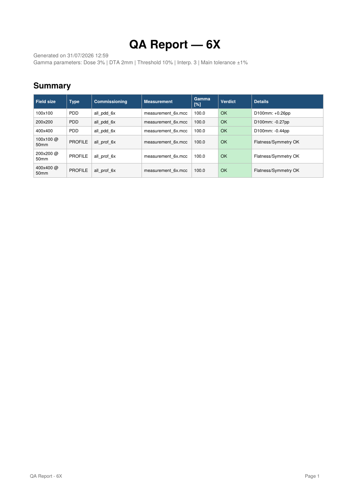
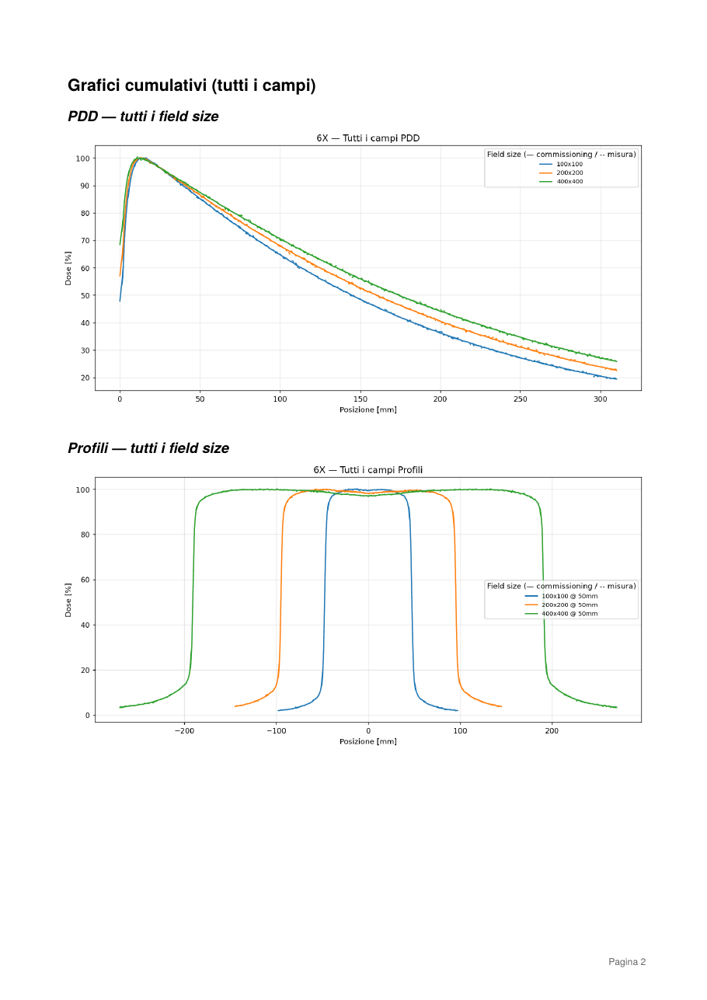

# Relative Dose 1D — Commissioning vs Measurement QA

App **Streamlit** per il confronto tra dati di **commissioning** (TPS, formato w2CAD `.data` o export bulk multi-campo) e **misure sperimentali** (PTW Verisoft, formato `.mcc`) di curve di dose 1D — PDD e profili. Include un generatore di **report PDF** per energia, con grafici cumulativi su tutti i field size.

Basata e adattata dal progetto [relative_dose_1d](https://github.com/) di Luis Alfonso Olivares Jimenez, riscritta come web app con parsing multi-curva, analisi gamma vettorizzata, metriche automatiche per i profili (flatness, symmetry, penombra) e reportistica PDF.

## Funzionalità

- **Caricamento multi-file**: puoi caricare più file di commissioning e più file di misura insieme; tutte le curve trovate vengono raccolte in un unico elenco selezionabile.
- **Parsing multi-curva**: un singolo file può contenere più scansioni (PDD, profili inplane/crossplane, a diverse profondità/field size): l'app le estrae tutte e le presenta in un menu a tendina, etichettate con file di origine, tipo, direzione, profondità e field size.
- **Tre formati di commissioning/misura riconosciuti automaticamente** (vedi tabella sotto), incluso un export **bulk multi-campo** (tutti i field size in un unico file).
- **Analisi gamma index 1D** (globale, dosi normalizzate 0–100%), con parametri configurabili: dose difference [%], distance-to-agreement [mm], soglia dose [%], punti di interpolazione.
- **Dose a profondità specifica** (solo per le PDD): confronto tra commissioning e misura della dose interpolata a una profondità scelta (default 100 mm), con verifica di tolleranza **±1%** (differenza assoluta in punti percentuali).
- **Flatness, Symmetry e Penombra** (solo per i profili), calcolate secondo definizione IEC-style, con:
  - verifica di tolleranza **±1%** applicata solo a **Flatness** e **Symmetry**;
  - Field size, Center e Penombra riportati per riferimento, senza verifica di tolleranza;
  - un **alert dedicato** se il field size misurato differisce da quello di commissioning oltre l'1%.
- **Supporto ai profili parziali** ("metà profilo"): se il commissioning contiene solo un lato del profilo (prassi comune per risparmiare tempo di scansione assumendo un campo simmetrico), l'app lo rileva automaticamente e:
  - stima field size/flatness assumendo simmetria rispetto all'asse centrale (x=0);
  - calcola la penombra solo sul lato disponibile (l'altro lato è `N/A`);
  - riporta la symmetry come `N/A` (non verificabile da un solo lato) ed esclude quel confronto dalla verifica di tolleranza.
- **Report PDF per energia**: genera un unico documento con tutte le curve (PDD + profili) di un'energia/fascio, con abbinamento automatico commissioning↔misura per field size (e profondità, per i profili). Vedi sezione dedicata sotto.

## Formati file supportati

| Formato | Estensione | Uso tipico | Note |
|---|---|---|---|
| w2CAD (TPS Eclipse) | `.data` | Commissioning | Curve delimitate da `$STOM...$ENOM` o `$STOD...$ENOD`. Il tipo di curva (PDD/profilo) è dedotto dai metadati `%title` / `%axis legend`, non dal tag (alcuni export usano `$STOD` per tutto). |
| **Bulk multi-campo** (export TPS batch) | *nessuna* (di solito) | Commissioning | Matrice CSV con **tutti i field size in un unico file**: colonne = field size [mm], righe = profondità (PDD) o distanza off-axis (profili). Per i profili il file contiene un blocco per ciascuna profondità (`Curves at depth [mm]: ...`). Riconosciuto **dal contenuto** (metadati `column legend:`/`row legend:`), non serve estensione — utile perché questi export spesso non ne hanno una. |
| PTW Verisoft (CC-Export) | `.mcc` | Misure | Un file può contenere più scansioni in un unico blocco `BEGIN_SCAN_DATA...END_SCAN_DATA`, con sotto-blocchi `BEGIN_SCAN n...END_SCAN n` per ciascuna curva (metadati `SCAN_CURVETYPE`, `SCAN_DEPTH`, `FIELD_INPLANE`/`FIELD_CROSSPLANE`). È supportato anche il vecchio formato "flat" (un blocco `BEGIN_SCAN_DATA` per curva) come fallback. |

I parser sono tolleranti ma seguono le convenzioni osservate nei file reali testati; export molto diversi potrebbero richiedere piccoli adattamenti.

## Esempi

Grafici generati dall'app (dati reali di test perturbati con piccolo rumore sintetico per illustrare un confronto commissioning vs misura tipico).

### PDD


Per questa stessa coppia di curve, il confronto **dose a profondità specifica** (default 100 mm) restituito dall'app è:

| Profondità | Commissioning | Misura | Differenza | Entro ±1% |
|---|---:|---:|---:|:---:|
| 100 mm | 69.35% | 69.88% | +0.53 pp | ✅ |

### Profilo


Tabella dei parametri corrispondente all'esempio di profilo sopra:

| Parametro | Commissioning | Misura | Differenza | Verifica ±1% |
|---|---:|---:|---:|:---:|
| Flatness [%] | 1.731 | 2.358 | +0.63 pp | ✅ |
| Symmetry [%] | 0.492 | 1.212 | +0.72 pp | ✅ |
| Field size [mm] | 400.108 | 399.936 | −0.04% | — |
| Center [mm] | 0.208 | 0.210 | +0.00 mm | — |
| Left penumbra [mm] | 9.437 | 9.319 | −1.25% | — |
| Right penumbra [mm] | 9.471 | 9.638 | +1.76% | — |

### Report PDF per energia

Pagina di riepilogo (tabella con tutti i field size abbinati, gamma pass rate e verifica principale colorata):



Pagina con i grafici cumulativi (tutti i field size sovrapposti, uno per le PDD e uno per i profili — linea continua = commissioning, tratteggiata = misura):



## Installazione

```bash
git clone <repo-url>
cd <repo-folder>
pip install -r requirements.txt
```

Requisiti principali: `streamlit`, `numpy`, `matplotlib`, `reportlab`, `Pillow` (vedi `requirements.txt`).

## Avvio

```bash
streamlit run app.py
```

> Il **main file** da eseguire è sempre `app.py`. `dose_tools.py` è il modulo di parsing/analisi importato da `app.py` e non va lanciato direttamente.

## Utilizzo

### Confronto singola curva

1. Carica uno o più file di **commissioning** e uno o più file di **misura**.
2. Seleziona dai menu a tendina la curva di riferimento (commissioning) e quella da valutare (misura).
3. Conferma/correggi il tipo di curva rilevato (PDD o PROFILE).
4. Imposta i parametri dell'analisi gamma (dose%, DTA, soglia, interpolazione) e premi **Esegui analisi**.
5. Visualizza:
   - il grafico delle curve sovrapposte, la differenza e l'indice gamma;
   - il pass rate gamma e i punti valutati;
   - **se la curva è una PDD**: il confronto della dose a una profondità scelta (default 100 mm, modificabile), con la verifica di tolleranza ±1%;
   - **se la curva è un profilo**: la tabella flatness/symmetry/penombra con la verifica di tolleranza ±1% su flatness/symmetry e l'eventuale alert sul field size.

### Report PDF per energia

Nella sezione **"Report PDF per energia"** (in fondo alla pagina, disponibile appena hai caricato entrambi i lati):

1. Dai un nome all'energia/fascio (es. "6X FFF").
2. L'app abbina automaticamente ogni curva di commissioning alla curva di misura con lo stesso field size — e, per i profili, anche la stessa profondità (tolleranza ±0.5 mm) — mostrandoti un'anteprima della tabella di abbinamento e le eventuali curve senza corrispondenza.
3. Imposta la profondità per il controllo PDD e la tolleranza principale.
4. Premi **Genera report PDF** e scarica il documento.

Il PDF contiene, in quest'ordine:
- **Riepilogo**: tabella con tutte le coppie field size/tipo, gamma pass rate, verifica principale (colorata) e dettagli.
- **Grafici cumulativi**: un grafico con **tutti i field size PDD** sovrapposti e uno con **tutti i field size profilo** sovrapposti (commissioning a linea continua, misura tratteggiata, un colore per field size/profondità).
- **Una pagina per ogni coppia field size/tipo**: grafico grande a 3 pannelli (curve sovrapposte / differenza / gamma) + tabella metriche (dose a profondità per le PDD, flatness/symmetry/penombra per i profili).
- **Pagina di approvazione**: campi per data e firma dello specialista in Fisica Medica (il nome, se inserito nell'app, viene riportato automaticamente).

Ogni pagina del PDF ha un **numero di pagina** in basso a destra e, se configurato, un **logo** in alto (vedi sotto).

## Struttura del progetto

```
.
├── app.py            # interfaccia Streamlit (upload, selezione curve, grafici, tabelle, report PDF)
├── dose_tools.py      # parsing file, gamma index, metriche di profilo, generazione report PDF
├── requirements.txt   # dipendenze Python
└── assets/            # immagini di esempio usate in questo README, più logo.png (opzionale)
```

### Logo nel report PDF

Per includere un logo in alto su ogni pagina del report PDF, metti un file
`logo.png` (oppure `logo.jpg` / `logo.jpeg`) nella cartella `assets/` accanto
ad `app.py`:

```
assets/logo.png
```

Viene rilevato automaticamente ad ogni avvio dell'app — non serve caricarlo
di nuovo ogni volta. Se il file non è presente, il report viene generato
normalmente senza logo. La sezione "Report PDF per energia" mostra un
messaggio che conferma se il logo è stato trovato.

## Dettagli sulle metriche

**PDD**
- **Dose a profondità specifica**: dose interpolata linearmente (via `numpy.interp`) alla profondità scelta (default 100 mm) sulle posizioni misurate. Se la profondità richiesta è fuori dal range misurato di una delle due curve, l'app segnala l'errore invece di restituire un valore non affidabile. La tolleranza ±1% è applicata come differenza assoluta in punti percentuali tra commissioning e misura.

**Profili**
- **Flatness**: `100 · (Dmax − Dmin) / (Dmax + Dmin)` calcolata sul volume centrale (80%) del campo, definito tra i punti al 50% di dose massima ai bordi.
- **Symmetry**: differenza massima punto-a-punto tra dose e dose speculare rispetto al centro, normalizzata sulla dose al centro (%). Non calcolabile per i profili parziali.
- **Penombra**: distanza tra i livelli 80%–20% di dose massima ai bordi del campo (sinistro e destro).
- **Field size / Center**: derivati dai punti di crossing al 50% della dose massima.

**Abbinamento automatico per il report per energia**
- Il matching commissioning↔misura si basa sul field size (parsing tollerante a precisioni diverse, es. `"100x100"` = `"100.00x100.00"`).
- Per i **profili**, viene richiesta anche la corrispondenza della **profondità di misura** (tolleranza ±0.5 mm) quando disponibile su entrambi i lati — evita di abbinare per errore misure a profondità diverse quando il commissioning ne include più di una per lo stesso field size (tipico degli export bulk multi-campo). Se l'informazione di profondità manca da un lato, il matching ricade sul solo field size.

## Limitazioni note

- L'indice gamma è globale (non locale) e 1D.
- Le metriche di profilo assumono un unico picco/plateau centrale; fasci molto atipici (es. FFF fortemente piccati, wedge, profili diagonali) vanno interpretati con cautela.
- Per i profili parziali si assume simmetria del campo rispetto a x=0: se il campo reale non è simmetrico, field size/flatness stimati saranno approssimati.
- Il parsing dei formati supportati è stato validato su file reali disponibili durante lo sviluppo; varianti di export non testate potrebbero richiedere adattamenti al parser.
- Il report PDF genera una pagina per ogni coppia field size/tipo abbinata: con moltissime combinazioni (es. decine di field size × più profondità) il documento può diventare corposo.

## Licenza

Da definire.
