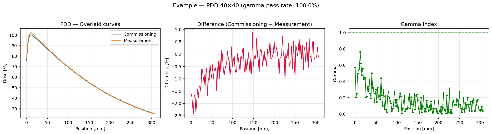
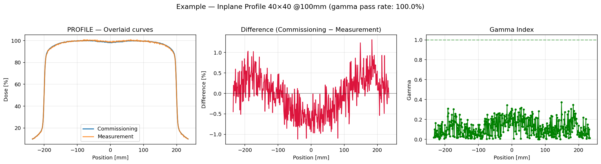
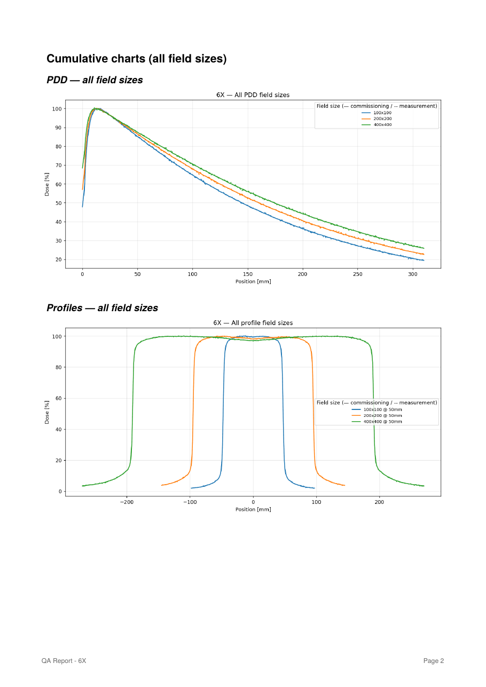

# Relative Dose 1D — Commissioning vs Measurement QA

**Streamlit** app for comparing **commissioning** data (TPS, w2CAD `.data` format or bulk multi-field export) against **experimental measurements** (PTW Verisoft, `.mcc` format) of 1D dose curves — PDD and profiles. Includes a **PDF report** generator per energy, with cumulative charts across all field sizes.

Based on and adapted from the [relative_dose_1d](https://github.com/) project by Luis Alfonso Olivares Jimenez, rewritten as a web app with multi-curve parsing, vectorized gamma analysis, automatic profile metrics (flatness, symmetry, penumbra) and PDF reporting.

## Features

- **Multi-file upload**: you can upload several commissioning files and several measurement files together; all curves found are collected into a single selectable list.
- **Multi-curve parsing**: a single file can contain several scans (PDD, inplane/crossplane profiles, at different depths/field sizes): the app extracts them all and presents them in a dropdown, labeled with source file, type, direction, depth and field size.
- **Three commissioning/measurement formats automatically recognized** (see table below), including a **bulk multi-field** export (all field sizes in a single file).
- **1D gamma index analysis** (global, doses normalized to 0–100%), with configurable parameters: dose difference [%], distance-to-agreement [mm], dose threshold [%], interpolated points.
- **Dose at a specific depth** (PDD only): comparison between commissioning and measurement of the dose interpolated at a chosen depth (default 100 mm), with a **±1%** tolerance check (absolute difference in percentage points).
- **Flatness, Symmetry and Penumbra** (profiles only), computed per the IEC-style definition, with:
  - **±1%** tolerance check applied only to **Flatness** and **Symmetry**;
  - Field size, Center and Penumbra reported for reference, without a tolerance check;
  - a **dedicated alert** if the measured field size differs from the commissioning one by more than 1%.
- **Support for partial profiles** ("half profiles"): if the commissioning data only contains one side of the profile (a common practice to save scan time by assuming a symmetric field), the app detects it automatically and:
  - estimates field size/flatness assuming symmetry about the central axis (x=0);
  - computes penumbra only on the available side (the other side is `N/A`);
  - reports symmetry as `N/A` (not verifiable from a single side) and excludes that comparison from the tolerance check.
- **PDF report per energy**: generates a single document with all curves (PDD + profiles) for an energy/beam, with automatic commissioning↔measurement matching by field size (and depth, for profiles). See the dedicated section below.

## Supported file formats

| Format | Extension | Typical use | Notes |
|---|---|---|---|
| w2CAD (Eclipse TPS) | `.data` | Commissioning | Curves delimited by `$STOM...$ENOM` or `$STOD...$ENOD`. The curve type (PDD/profile) is inferred from the `%title` / `%axis legend` metadata, not the tag (some exports use `$STOD` for everything). |
| **Bulk multi-field** (TPS batch export) | *none* (usually) | Commissioning **or TPS calculation** | CSV matrix with **all field sizes in a single file**: columns = field size [mm], rows = depth (PDD) or off-axis distance (profiles). For profiles the file contains one block per depth (`Curves at depth [mm]: ...`). Recognized **from the content** (`column legend:`/`row legend:` metadata), no extension needed. There are two variants, automatically distinguished by the file's `data:` field: **measured** (`OPD`/`OPP`) and **TPS-calculated** (`OPD_calculated`/`OPP_calculated`, e.g. Acuros/AAA algorithm) — the latter is labeled `TPS-calc (algorithm)` on the curves, useful to compare measurements against the TPS calculation as well as against measured commissioning. |
| PTW Verisoft (CC-Export) | `.mcc` | Measurements | A file can contain several scans in a single `BEGIN_SCAN_DATA...END_SCAN_DATA` block, with `BEGIN_SCAN n...END_SCAN n` sub-blocks for each curve (metadata `SCAN_CURVETYPE`, `SCAN_DEPTH`, `FIELD_INPLANE`/`FIELD_CROSSPLANE`). The older "flat" format (one `BEGIN_SCAN_DATA` block per curve) is also supported as a fallback. |

The parsers are tolerant but follow the conventions observed in the real files tested; very different exports may require small adjustments.

## Examples

Charts generated by the app (real test data perturbed with small synthetic noise to illustrate a typical commissioning vs. measurement comparison).

### PDD



For this same pair of curves, the **dose at a specific depth** (default 100 mm) comparison returned by the app is:

| Depth | Commissioning | Measurement | Difference | Within ±1% |
|---|---:|---:|---:|:---:|
| 100 mm | 69.35% | 69.88% | +0.53 pp | ✅ |

### Profile



Parameter table corresponding to the profile example above:

| Parameter | Commissioning | Measurement | Difference | Within ±1% |
|---|---:|---:|---:|:---:|
| Flatness [%] | 1.731 | 2.358 | +0.63 pp | ✅ |
| Symmetry [%] | 0.492 | 1.212 | +0.72 pp | ✅ |
| Field size [mm] | 400.108 | 399.936 | −0.04% | — |
| Center [mm] | 0.208 | 0.210 | +0.00 mm | — |
| Left penumbra [mm] | 9.437 | 9.319 | −1.25% | — |
| Right penumbra [mm] | 9.471 | 9.638 | +1.76% | — |

### PDF report per energy

Summary page (table with all matched field sizes, gamma pass rate and color-coded main verdict):


Cumulative charts page (all field sizes overlaid, one for PDDs and one for profiles — solid line = commissioning, dashed = measurement):



## Installation

```bash
git clone <repo-url>
cd <repo-folder>
pip install -r requirements.txt
```

Main requirements: `streamlit`, `numpy`, `matplotlib`, `reportlab`, `Pillow` (see `requirements.txt`).

## Running

```bash
streamlit run app.py
```

> The **main file** to run is always `app.py`. `dose_tools.py` is the parsing/analysis module imported by `app.py` and should not be run directly.

## Usage

### Single-curve comparison

1. Upload one or more **commissioning** files and one or more **measurement** files.
2. Select the reference (commissioning) curve and the one to evaluate (measurement) from the dropdown menus.
3. Confirm/override the detected curve type (PDD or PROFILE).
4. Set the gamma analysis parameters (dose%, DTA, threshold, interpolation) and click **Run analysis**.
5. View:
   - the overlaid-curves chart, the difference and the gamma index;
   - the gamma pass rate and evaluated points;
   - **if the curve is a PDD**: the comparison of the dose at a chosen depth (default 100 mm, editable), with the ±1% tolerance check;
   - **if the curve is a profile**: the flatness/symmetry/penumbra table with the ±1% tolerance check on flatness/symmetry and the possible field-size alert.

### PDF report per energy

In the **"PDF report per energy"** section (at the bottom of the page, available as soon as you've uploaded both sides):

1. Give the energy/beam a name (e.g. "6X FFF").
2. The app automatically matches each commissioning curve to the measurement curve with the same field size — and, for profiles, also the same depth (±0.5 mm tolerance) — showing you a preview of the match table and any curves without a match.
3. Set the depth for the PDD check and the main tolerance.
4. Click **Generate PDF report** and download the document.

The PDF contains, in this order:
- **Summary**: table with all field size/type pairs, gamma pass rate, main verdict (color-coded) and details.
- **Cumulative charts**: one chart with **all PDD field sizes** overlaid and one with **all profile field sizes** overlaid (commissioning as a solid line, measurement dashed, one color per field size/depth).
- **One page per field size/type pair**: a large 3-panel chart (overlaid curves / difference / gamma) + metrics table (dose at depth for PDDs, flatness/symmetry/penumbra for profiles).
- **Approval page**: fields for the Medical Physicist's date and signature (the name, if entered in the app, is filled in automatically).

Every PDF page has a **page number** at the bottom right and, if configured, a **logo** at the top (see below).

## Project structure

```
.
├── app.py            # Streamlit interface (upload, curve selection, charts, tables, PDF report)
├── dose_tools.py      # file parsing, gamma index, profile metrics, PDF report generation
├── requirements.txt   # Python dependencies
└── assets/            # example images used in this README, plus logo.png (optional)
```

### Logo in the PDF report

To include a logo at the top of every PDF report page, place a file named
`logo.png` (or `logo.jpg` / `logo.jpeg`) in the `assets/` folder next to
`app.py`:

```
assets/logo.png
```

It is picked up automatically every time the app starts — no need to upload
it each time. If the file isn't present, the report is generated normally
without a logo. The "PDF report per energy" section shows a message
confirming whether the logo was found.

## Metric details

**PDD**
- **Dose at a specific depth**: dose linearly interpolated (via `numpy.interp`) at the chosen depth (default 100 mm) over the measured positions. If the requested depth falls outside the measured range of either curve, the app reports the error instead of returning an unreliable value. The ±1% tolerance is applied as the absolute difference in percentage points between commissioning and measurement.

**Profiles**
- **Flatness**: `100 · (Dmax − Dmin) / (Dmax + Dmin)` computed over the central volume (80%) of the field, defined between the 50%-of-maximum-dose points at the edges.
- **Symmetry**: maximum point-to-point difference between the dose and its mirror image about the center, normalized to the dose at the center (%). Not computable for partial profiles.
- **Penumbra**: distance between the 80%–20% maximum-dose levels at the field edges (left and right).
- **Field size / Center**: derived from the 50%-of-maximum-dose crossing points.

**Automatic matching for the per-energy report**
- Commissioning↔measurement matching is based on field size (parsing tolerant to different precisions, e.g. `"100x100"` = `"100.00x100.00"`).
- For **profiles**, matching also requires the **measurement depth** to agree (±0.5 mm tolerance) whenever available on both sides — this avoids mistakenly pairing measurements at different depths when the commissioning data includes more than one depth for the same field size (typical of bulk multi-field exports). If depth information is missing on one side, matching falls back to field size alone.

## Known limitations

- The gamma index is global (not local) and 1D.
- Profile metrics assume a single central peak/plateau; very atypical beams (e.g. strongly peaked FFF, wedges, diagonal profiles) should be interpreted with caution.
- For partial profiles, field symmetry about x=0 is assumed: if the real field isn't symmetric, the estimated field size/flatness will be approximate.
- Parsing of the supported formats was validated against real files available during development; untested export variants may require parser adjustments.
- The PDF report generates one page per matched field size/type pair: with very many combinations (e.g. dozens of field sizes × several depths) the document can become large.

## License

To be defined.
